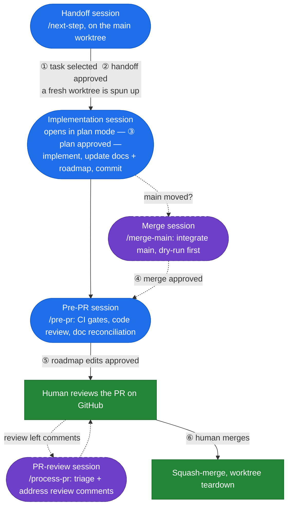
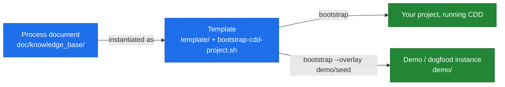

# Claude-Driven Development (CDD)

[](https://github.com/drabaioli/cdd/actions/workflows/template-smoke.yml)

You want to build real software with Claude Code without losing control of the decisions — and without the docs, the roadmap, and the agent's context rotting as the project grows. CDD is a human-in-the-loop workflow for exactly that: the agent carries the implementation, verification, and documentation work across git worktrees, while every decision passes through an explicit human checkpoint.

Two ideas do most of the work:

- **Every session is a fresh context doing exactly one job.** Sessions hand off through files (a handoff file, the roadmap, the docs), never by sharing a chat window.
- **Automate everything except decisions.** Six checkpoints are where automation deliberately stops; the human chooses, approves, and merges — the agent does the rest.

## The lifecycle

A task flows through up to five sessions, each driven by one slash command:



Blue boxes are Claude sessions (fresh context, one job each), green are human/GitHub steps, dashed are optional side-loops. ①–⑥ are the six human checkpoints — the agent never proceeds past one without explicit confirmation. The [process document](doc/knowledge_base/claude-driven-development.md) describes the full lifecycle, the artifacts, and the edit rules.

## Quick start (using CDD on a new project)

```bash
git clone https://github.com/drabaioli/cdd.git ~/Code/cdd && cd ~/Code/cdd
./bootstrap-cdd-project.sh \
  --name "My Project" \
  --slug myproj \
  --path ~/Code/my-project
```

The script copies the template, substitutes the placeholders, and makes the initial scaffold commit. Then fill in `CLAUDE.md` and `doc/knowledge_base/roadmap.md`, source `tools/myproj-worktree.sh` from `~/.bashrc`, run `claude`, and start with `/next-step`. Full procedure in [`template/BOOTSTRAP.md`](template/BOOTSTRAP.md). To install CDD into an *existing* project, use `/retrofit` from a Claude Code session in this repo instead.

## What's in this repo



- **The process document**: [`doc/knowledge_base/claude-driven-development.md`](doc/knowledge_base/claude-driven-development.md). The philosophy, the lifecycle, the artifacts, the edit rules. Read this first if you want to understand what CDD is and why.
- **The template**: [`template/`](template/). Copy-paste material for bootstrapping a new project. See [`template/BOOTSTRAP.md`](template/BOOTSTRAP.md) for the bootstrap procedure.
- **The demo subsystem**: [`demo/`](demo/). A filled-in seed project ("Markdown Renderer") plus create/teardown automation, used both to demo the workflow and to dogfood it.

Changes flow process-first, template-second, and never from the demo back into the template. This repo uses CDD on itself: its own scaffolding (`CLAUDE.md`, `.claude/commands/`, `doc/`, `tools/cdd-worktree.sh`) sits at the root, and the template is content this project ships.

## Status

In active use. The workflow has been dogfooded end-to-end on a downstream demo project (see [`demo/`](demo/)), including full task cycles with real merges and PR reviews, and the friction found has been folded back into the template. See [`doc/knowledge_base/roadmap.md`](doc/knowledge_base/roadmap.md) for what's done and what's next.
