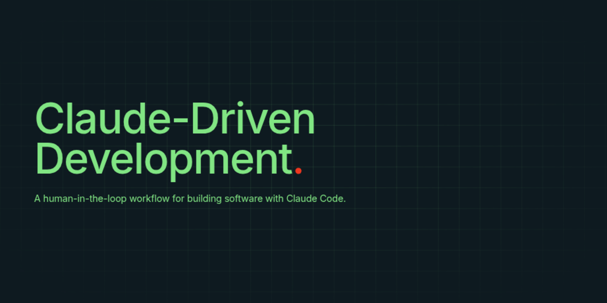

# Claude-Driven Development (CDD)



[](https://github.com/drabaioli/cdd/actions/workflows/template-smoke.yml)
[](LICENSE)
[](https://claude.com/claude-code)
[](https://github.com/drabaioli/cdd/issues)
[](doc/knowledge_base/roadmap.md)

CDD (Claude-Driven Development) is a human-in-the-loop workflow for building software with Claude Code. AI agents do as much of the coding as possible and automate every step that can be — but a developer stays in the loop at the decisions that matter.

Rather than one long conversation that rots as its context fills with stale detail, each step is a fresh session with one job and exactly the context it needs, loaded at the right time.

The workflow also holds itself and your code to real engineering standards: it applies best practices to itself — reviewing its own code, writing specs — and enforces tests, documentation hygiene, linting, and formatting on every change. Keeping the docs and the roadmap current is part of that discipline, and it's what lets each fresh session load only the context it needs.

## ⚙️ How it works

Every task moves through the same cycle. Each step is a fresh Claude Code session doing exactly one job, handing off to the next through files (a handoff file, the roadmap, the docs) rather than a shared chat window — so context stays lean and never bloats with material the current job doesn't use. The locks down the left of the diagram are the human gates: the agent never crosses one without your explicit approval, and approving the plan is the load-bearing one.


One full turn around the cycle:

1. **Select a task** — one, or several to run in parallel.
2. **Write the handoff and create a git worktree** for the task, isolated from your main checkout.
3. **Launch an implementation session.** It opens in plan mode; you approve the plan, then let it implement. You know what to expect, because you approved the plan.
4. **Merge from the base branch if it moved** while you were working, approving the merge plan.
5. **Let an agent review the code before the PR opens** — this is also where tests run and the docs are checked, linted, and formatted. It opens the PR at the end.
6. **Review the PR** and ask the agent to address your feedback.
7. **Merge the PR, delete the worktree, pull the changes into your main worktree — and start over.**

The [process document](doc/knowledge_base/claude-driven-development.md) describes the full lifecycle, the artifacts, the edit rules, and the reasoning behind every gate. Read it first if you want to understand what CDD is and why.

## 🚀 Quick start

CDD's front door is its guided commands. Here's the shortest path from zero to your first task:

```bash
git clone https://github.com/drabaioli/cdd.git && cd cdd
claude
```

Then, from inside that Claude Code session:

1. Run **`/cdd-bootstrap`** and start a new project. It walks you through defining the project and drafting a real roadmap through conversation, then scaffolds everything in one go — overview, `CLAUDE.md`, and roadmap already filled in.
2. **`cd`** into your freshly created project and launch `claude` there.
3. Run **`/cdd-next-step`** to scope your first task.
4. Lift off — you're now running the task cycle above.

Other entry points, run the same way from a session inside this repo:

- **Bring CDD to a project you already have:** run **`/cdd-retrofit`**. It installs CDD into an existing codebase, or upgrades a project already running CDD, preserving your local customizations along the way.
- **Produce a one-off deliverable** that doesn't warrant a whole project (a single script plus a README, no roadmap or project substrate): run **`/cdd-quick-create`**.

Prefer to script it? The non-interactive `tools/bootstrap-cdd-project.sh` does the same scaffolding without the guided conversation.

## 🎯 Three objectives

CDD is built around three goals, in tension and balanced on purpose:

- **Automate everything except the decisions that matter.** Everything between the human gates is automated; the gates — picking the task, approving the plan, approving any base-branch merge, merging the PR — never are.
- **Bake in engineering best practices.** Tests, linting, formatting, CI, and living documentation aren't bolted on at the end. The workflow expects them at every step, so quality and context don't erode as the project grows.
- **Improve the workflow as you use it.** CDD is meant to be turned on itself. Friction surfaced in a session folds back into the process and the template, so the workflow gets sharper over time.

## 📖 Command reference

CDD ships seven slash commands, all prefixed `cdd-` so they autocomplete as a group.

**Per-task cycle**, shipped into every CDD project via the template:

| Command | What it does |
| --- | --- |
| `/cdd‑next‑step` | Scope the next task and write a handoff for a fresh implementation session. Three front-ends: the next roadmap item, a typed task prompt (off-roadmap), or a GitHub issue (`#NN` / a bare integer / the `issue` keyword). |
| `/cdd‑merge‑base` | Integrate the base branch into a feature branch when the base has advanced under you (dry-run first, then apply). |
| `/cdd‑pre‑pr` | Pre-PR checklist: CI gates, code review, and doc/roadmap reconciliation; ends with an opt-in step to open the PR. |
| `/cdd‑process‑pr` | Triage and address the open PR's review feedback, reply in-thread, and commit and push. |

**CDD-repo-only**, run from a session inside this repo; they operate *on* a target, so the template ships no copy:

| Command | What it does |
| --- | --- |
| `/cdd‑bootstrap` | Guided greenfield: define the project and draft a roadmap through conversation, then scaffold it. |
| `/cdd‑retrofit` | Install or upgrade CDD in an existing project. |
| `/cdd‑quick‑create` | Produce a one-off self-contained deliverable (script + README), no project substrate. |

`cdd-worktree` (and its companions `cdd-worktree-done`, `cdd-worktree-list`, and `cdd-worktree-resume`) is a **shell helper**, not a slash command. It's a single project-independent script — a machine-global toolchain dependency, like `git` or `gh` — that you install once and that then works in every CDD project. From a CDD repo checkout: `tools/cdd-worktree.sh install`. On a fresh machine with only a downstream project (no CDD repo), one command fetches and installs it:

```bash
curl -fsSL https://raw.githubusercontent.com/drabaioli/cdd/main/tools/cdd-worktree.sh \
  --create-dirs -o ~/.cdd/tools/cdd-worktree.sh \
  && bash ~/.cdd/tools/cdd-worktree.sh install
```

Either form wires `~/.bashrc` and `~/.zshrc` (idempotent); open a new shell afterwards. It spins up and tears down the per-task git worktree that an implementation session runs in, and `cdd-worktree-resume [<branch>]` recreates that worktree on a second machine — tracking the existing remote branch, no handoff needed — so a task started elsewhere can be picked up to run `/cdd-process-pr`, `/cdd-merge-base`, or `/cdd-pre-pr`.

## 💬 Questions?

The fastest way to understand CDD is to ask it directly: launch `claude` on your local clone of this repo and ask away. The process doc, the template, and these docs are all right there for it to read.

## Contributing

At this stage CDD accepts **GitHub issues only; pull requests aren't open yet**. Bug reports, suggestions, and questions about the workflow are very welcome: please [open an issue](https://github.com/drabaioli/cdd/issues). Have a change in mind? Raise it as an issue first and we can discuss it there. Direct PRs aren't being accepted for now. That will change as the project opens up.

## 📍 Status

Currently in active development and working quite well. See [`doc/knowledge_base/roadmap.md`](doc/knowledge_base/roadmap.md) for what's done and what's next.

## License

[MIT](LICENSE) © Diego Andres Rabaioli.
